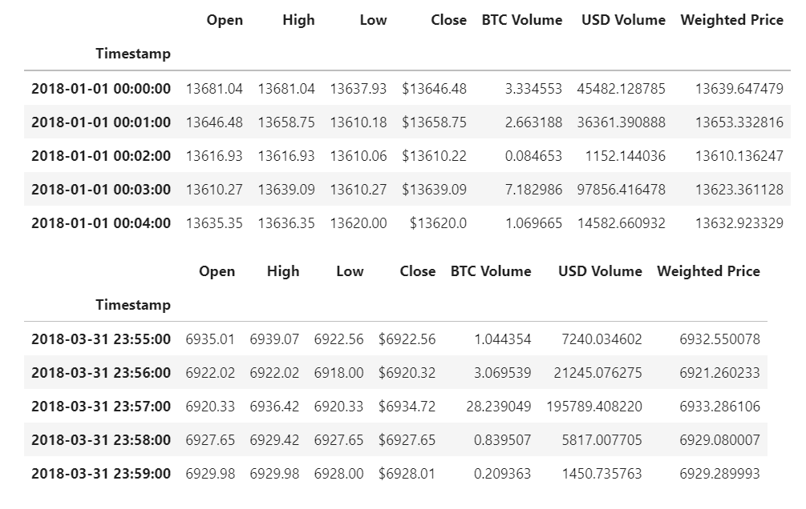

# Challenge_3

## Project Overview
This project analyzes historical Bitcoin trade data from Coinbase and Bitstamp. I added graphs of two types. I used xticks and rotation to format graphs I. created legends with color cordination throughout the doc. Created several data sets. Use the describe function and several others. Use iloc and loc. Use several forulas to arbitage bitcoin across 2 platfroms to find days where one could make money by buying on one exchnage and selling on the other.

## Methodology
There are three main parts to the data analysis: 
1. Collect the data
2. Prepare the data 
3. Analyze the data

Below is a sample of the dataset

## Findings
 From the data analysis findings, there were many opportunites to make profit early in 2018. However, these opportunities significantly decreased later in the year. From January, February and March, it was only January and February that provided users with an opporutnity to make profitable trades. As time progressed, the exchanges analyzed started to becomre more efficient. Hence, eliminating the opportunity for arbitrage trading profit. 

